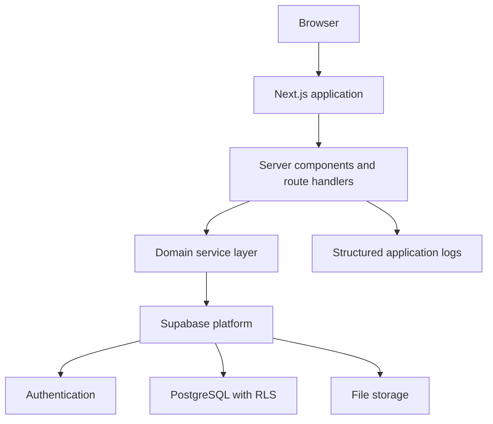

# CampaignOps System Architecture

## 1. Architecture Style

CampaignOps will use a modular monolith.

The frontend, backend routes and business logic will exist in one Next.js application. Supabase will provide authentication, PostgreSQL and file storage.

A separate microservice architecture is unnecessary for the MVP because it would increase deployment, networking and debugging complexity without providing useful benefits at the current scale.

## 2. Technology Decisions

| Area | Technology | Responsibility |
|---|---|---|
| Web application | Next.js and TypeScript | UI, server rendering and backend routes |
| Styling | Tailwind CSS and shadcn/ui | Responsive interface and reusable components |
| Validation | Zod | Validate API and form inputs |
| Authentication | Supabase Auth | Registration, login and sessions |
| Database | Supabase PostgreSQL | Relational application data |
| Authorization | PostgreSQL RLS and backend checks | Workspace and role protection |
| File storage | Supabase Storage | Campaign attachments |
| Unit testing | Vitest | Business rules and utilities |
| Database testing | pgTAP | Constraints, functions and RLS |
| Browser testing | Playwright | Complete user workflows |
| CI | GitHub Actions | Automated quality checks |
| Deployment | Vercel and Supabase | Application and hosted database |
| Monitoring | Sentry and platform logs | Production error investigation |

## 3. High-Level Architecture



## 4. Request Flow

For an authenticated write operation:

1. The browser submits a request to a Next.js route handler.
2. The route handler reads the authenticated session.
3. Zod validates the request body.
4. The route handler calls a domain service.
5. The domain service checks the business rule.
6. The data-access layer executes the database operation.
7. PostgreSQL RLS performs the final authorization check.
8. Important changes create an audit-log record.
9. The backend returns a structured response.
10. The interface updates or displays an understandable error.

## 5. Application Layers

### Presentation Layer

Responsible for:

- Pages and layouts
- Forms
- Loading states
- Empty states
- Error messages
- Accessibility
- Responsive behaviour

It must not contain database credentials or sensitive authorization logic.

### Route Layer

Responsible for:

- Reading HTTP requests
- Checking authentication
- Validating input
- Calling the correct service
- Mapping errors to HTTP responses

Route handlers should not contain large amounts of business logic.

### Domain Service Layer

Responsible for:

- Campaign status rules
- Approval rules
- Role requirements
- Task assignment rules
- Transactions
- Audit-log decisions

This layer should be testable without rendering the interface.

### Data-Access Layer

Responsible for:

- Supabase queries
- Database function calls
- Typed query results
- Converting database errors into application errors

### Database Layer

Responsible for:

- Data integrity
- Relationships
- Constraints
- Indexes
- Row Level Security
- Database functions
- Audit records

## 6. Planned Folder Structure

```text
src/
  app/
  components/
  features/
    auth/
    organizations/
    clients/
    campaigns/
    tasks/
    approvals/
  lib/
    supabase/
    validation/
  server/
    repositories/
    services/
  types/

supabase/
  migrations/
  tests/
  seed.sql

tests/
  e2e/

docs/
```

Folders will be created only when needed. Empty architecture folders will not be generated in advance.

## 7. Security Boundaries

- The browser may use only the Supabase publishable key.
- Secret or service-role keys must never enter browser code.
- Every private route must verify the user session.
- Backend authorization provides understandable errors.
- RLS provides the final database-level protection.
- Organization membership controls tenant access.
- Role checks control owner, manager and member operations.
- Input validation occurs before database mutation.
- Database constraints remain active even if application validation fails.
- The MVP will not use a service-role key unless a specific server-only requirement is approved.

## 8. Environments

### Local

- Local Next.js server
- Local Supabase through Docker
- Development seed data
- Local environment variables

### Preview

- Vercel preview deployment
- Separate non-production database configuration
- Used for pull-request testing

### Production

- Vercel production deployment
- Production Supabase project
- Production secrets
- Monitoring and smoke tests

Production data must never be copied into the local seed file.

## 9. Database Migration Order

Migrations will be applied in dependency order:

1. Extensions and enums
2. Profiles
3. Organizations and memberships
4. Clients, campaigns and tasks
5. Approvals, comments and attachments
6. Database functions and triggers
7. Row Level Security policies
8. Performance indexes

Development sample data belongs in `supabase/seed.sql`, not production migrations.

## 10. Important Architecture Decisions

- Use a modular monolith, not microservices.
- Use SQL migrations as the database source of truth.
- Do not add Prisma during the first implementation.
- Use backend routes for important mutations.
- Keep RLS enabled even when backend authorization exists.
- Build one complete feature slice at a time.
- Add AI functionality only after the core workflow is stable.