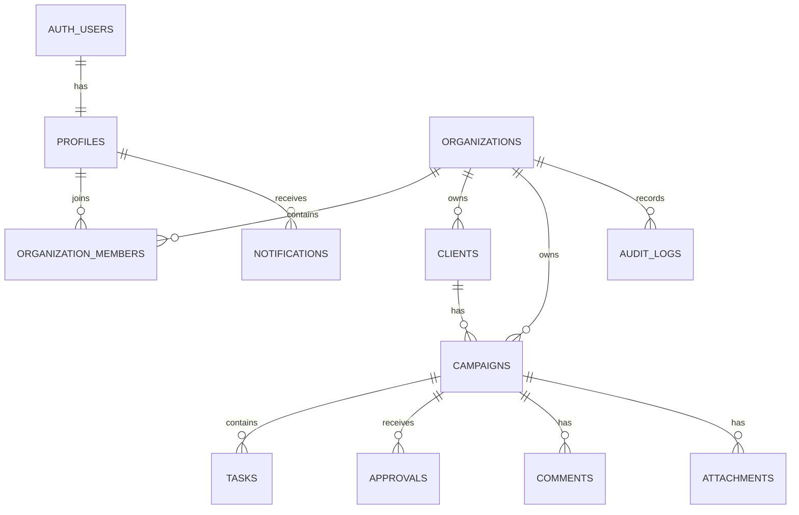

# CampaignOps Database Design

## 1. Design Principles

- Supabase `auth.users` stores authentication accounts.
- `public.profiles` stores application profile information.
- Every business record belongs to an organization.
- UUIDs are used for primary keys.
- Times use `timestamptz`.
- SQL constraints protect data integrity.
- Row Level Security protects organization data.
- Schema changes are made through version-controlled migrations.

## 2. Database Enums

### organization_role

- `owner`
- `manager`
- `member`

### campaign_status

- `draft`
- `active`
- `in_review`
- `approved`
- `completed`
- `archived`

### task_status

- `todo`
- `in_progress`
- `blocked`
- `done`

### approval_status

- `pending`
- `approved`
- `changes_requested`

## 3. Entity Relationship Diagram

## 4. Table Design

| Table | Purpose | Important columns |
|---|---|---|
| `profiles` | Extends an authenticated user | `id`, `full_name`, `avatar_url` |
| `organizations` | Represents a workspace | `id`, `name`, `slug`, `created_by` |
| `organization_members` | Connects users to organizations | `organization_id`, `user_id`, `role` |
| `organization_invitations` | Stores pending invitations | `organization_id`, `email`, `role`, `token_hash`, `expires_at` |
| `clients` | Stores organization clients | `id`, `organization_id`, `name`, `contact_email` |
| `campaigns` | Stores campaign information | `id`, `organization_id`, `client_id`, `name`, `status`, `due_date` |
| `tasks` | Stores campaign work | `id`, `organization_id`, `campaign_id`, `assignee_id`, `status` |
| `approvals` | Stores campaign reviews | `id`, `campaign_id`, `status`, `submitted_by`, `reviewed_by` |
| `comments` | Stores campaign discussion | `id`, `campaign_id`, `author_id`, `body` |
| `attachments` | Stores uploaded-file metadata | `id`, `campaign_id`, `uploaded_by`, `storage_path` |
| `audit_logs` | Records important actions | `id`, `organization_id`, `actor_id`, `action`, `metadata` |
| `notifications` | Stores user notifications | `id`, `recipient_id`, `title`, `read_at` |

## 5. Important Constraints

- `profiles.id` references `auth.users.id`.
- Organization slugs must be unique.
- Organization membership uses a composite primary key of `organization_id` and `user_id`.
- A user cannot have duplicate membership in one organization.
- A campaign must reference a client from the same organization.
- Campaign due date cannot be earlier than its start date.
- A task assignee must belong to the task’s organization.
- Empty campaign, task and comment text is rejected.
- Approval status must use the `approval_status` enum.
- Reviewed approvals require `reviewed_by` and `reviewed_at`.
- Invitation secrets are stored as hashes, not raw tokens.

## 6. Tenant Isolation

Tenant-owned tables contain `organization_id`.

This makes organization filters and RLS policies easier to understand and index. Composite foreign keys will prevent a record from referencing data in another organization.

Examples:

- A campaign cannot use another organization’s client.
- A task cannot use another organization’s campaign.
- An approval cannot use another organization’s campaign.

## 7. Row Level Security Plan

### Owner

- Read and manage the organization
- Manage members
- Manage all organization records

### Manager

- Read organization data
- Manage clients, campaigns and tasks
- Review campaign approvals

### Member

- Read organization data
- Update assigned tasks
- Add comments and attachments
- Submit campaigns for review

RLS remains active even when the backend checks authorization.

## 8. RLS Recursion Warning

Policies on `organization_members` must not repeatedly query their own protected table.

Membership and role checks will use carefully designed `security definer` helper functions. These functions will be created only after all referenced tables exist.

## 9. Required Transactions

The following operations must be atomic:

- Create organization and owner membership
- Accept an invitation and create membership
- Submit a campaign for approval
- Review an approval and change campaign status
- Change campaign status and create an audit record

If one statement fails, the complete operation must roll back.

## 10. Planned Indexes

- `organization_members(user_id)`
- `organization_members(organization_id, role)`
- `clients(organization_id, name)`
- `campaigns(organization_id, status)`
- `campaigns(organization_id, due_date)`
- `tasks(organization_id, assignee_id, status)`
- `tasks(campaign_id)`
- `approvals(campaign_id, status)`
- `comments(campaign_id, created_at)`
- `audit_logs(organization_id, created_at)`
- `notifications(recipient_id, read_at)`

Indexes will later be checked with `explain analyze`.

## 11. Migration Order

1. Extensions and enums
2. Profiles
3. Organizations, memberships and invitations
4. Clients
5. Campaigns
6. Tasks
7. Approvals, comments and attachments
8. Notifications and audit logs
9. Functions and triggers
10. RLS policies
11. Indexes

Development sample records belong in `supabase/seed.sql`, not schema migrations.